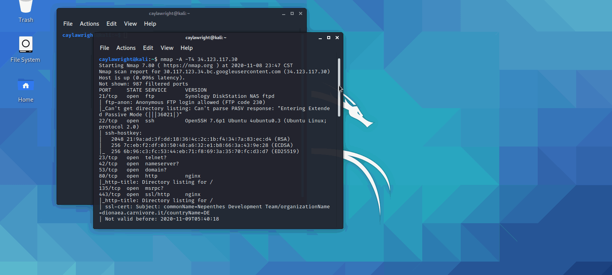
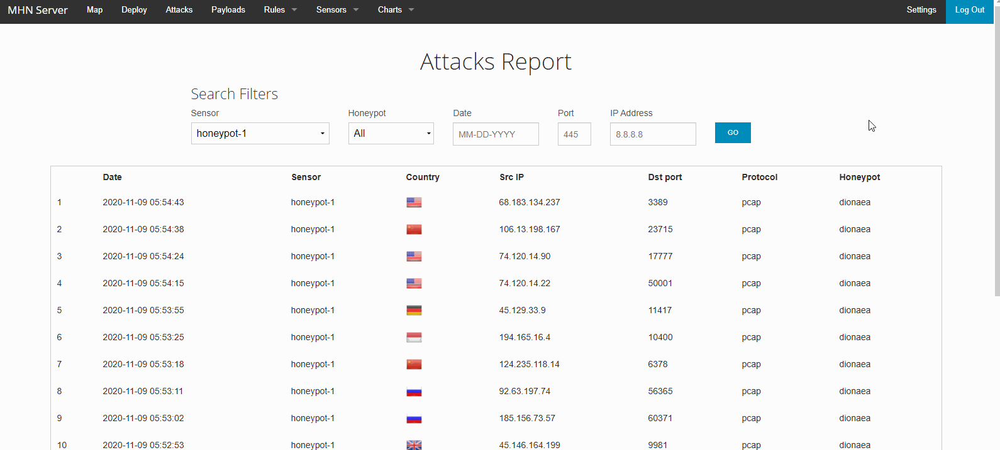

# Honeypot Assignment

**Time spent:** **10** hours spent in total 

**Objective:** Create a honeynet using MHN-Admin. Present your findings as if you were requested to give a brief report of the current state of Internet security. Assume that your audience is a current employer who is questioning why the company should allocate anymore resources to the IT security team.

### MHN-Admin Deployment (Required)

**Summary:** 

I deployed my honeypt by using my Kali Virtualbox.

### Dionaea Honeypot Deployment (Required)

**Summary:**

I created a decoy application Dionaea for hackers to try to exploit my Honeypot. Deploying this Honeypot has shown me how fast and how many poeple can try to attack my system. 

### Database Backup (Required) 

**Summary:** What is the RDBMS that MHN-Admin uses? What information does the exported JSON file record?

The RDBMS collects the data using SQL for querying and maintaining the database in MHN-Admin. 
The exported JSON file recored the Date, Sensor, Country, Src IP, Dst port, Protocol, and Honeypot name. 

## Notes
Some challenges I faced was getting the correct permissions for my API. Once I checked my settings and configurations, I was able to complete the assignment.

